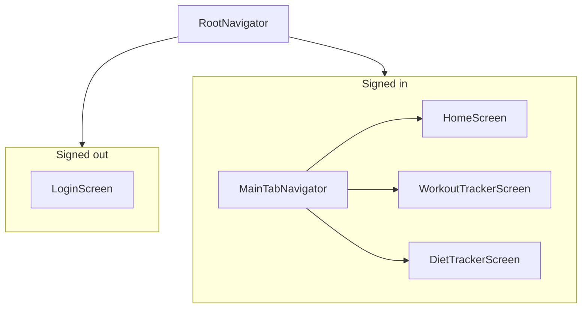

# SetFuel — project architecture

Living reference for how the repo is organized and how to extend it. **Update this file** when you add navigators, major screens, global state, or backend integration.

## What SetFuel is

- **Product**: Daily **workout** logging (exercises → sets with reps / kg) and **diet** logging (meals + calories), Android-first.
- **Current phase**: Mobile UI and **local-only** state; **placeholder** Google sign-in; `backend/` is reserved for Node + PostgreSQL later.

## Repository layout

```text
setfuel/
├── ARCHITECTURE.md      # This file
├── README.md            # Setup, EAS builds, changelog-style features
├── RELEASE_NOTES.md
├── backend/             # Placeholder — API + Postgres (future)
└── mobile/              # Expo SDK 54 + React Native + TypeScript
    ├── App.tsx          # Root providers + navigation container (imports `global.css`)
    ├── index.ts         # Expo registerRootComponent → App
    ├── app.json         # Expo config (name, slug, Android package, EAS projectId)
    ├── babel.config.js  # `nativewind` + `jsxImportSource: nativewind`, Reanimated plugin
    ├── metro.config.js  # `withNativeWind` (Tailwind / CSS entry)
    ├── tailwind.config.js
    ├── global.css       # `@tailwind` directives (NativeWind)
    ├── nativewind-env.d.ts
    ├── eas.json         # EAS Build profiles (e.g. preview APK)
    ├── assets/
    └── src/
        ├── components/ui/   # Reusable UI primitives
        ├── context/         # Global React context (auth only today)
        ├── data/            # Static / reference data (routines)
        ├── navigation/      # Navigators + typed param lists
        ├── screens/         # Feature screens by domain
        └── theme/           # Design tokens (colors, spacing)
```

## Mobile stack

| Layer | Choice |
|--------|--------|
| Runtime | Expo ~54, React 19, React Native 0.81 |
| Language | TypeScript (`strict: true`, no path aliases — use relative imports) |
| Navigation | `@react-navigation/native`, native stack, bottom tabs |
| Icons | `@expo/vector-icons` (Ionicons on tabs) |
| Safe area | `react-native-safe-area-context` |
| Styling | **NativeWind v4** (Tailwind CSS utilities via `className`) + `react-native-reanimated` (required peer); see `tailwind.config.js` / `global.css` |
| Global UI state | `AuthContext` only |

## Bootstrap chain

1. `mobile/index.ts` → `registerRootComponent(App)`.
2. `mobile/App.tsx` wraps:
   - `SafeAreaProvider`
   - `AuthProvider` (`src/context/AuthContext.tsx`)
   - `NavigationContainer`
   - `StatusBar` (Expo)
   - `RootNavigator`

## Navigation model

Single **root native stack** switches entire trees based on auth (no nested auth stack today).



| Navigator | File | Responsibility |
|-----------|------|------------------|
| Root stack | `src/navigation/RootNavigator.tsx` | `Login` vs `Main` (tabs); `headerShown: false`, fade animation |
| Tabs | `src/navigation/MainTabNavigator.tsx` | Home, Workout, Diet + tab bar styling from theme |

**Types**: `src/navigation/types.ts` — `RootStackParamList`, `MainTabParamList`. When adding a screen, update these and the relevant navigator.

## State and persistence

| Concern | Where | Notes |
|---------|--------|--------|
| Signed in flag | `AuthContext` | `signInWithGooglePlaceholder`, `signOut` — replace with real OAuth + tokens later |
| Workout session | `WorkoutTrackerScreen` local `useState` | Exercises, sets, modals; lost on unmount / app kill until you add persistence/API |
| Meals list | `DietTrackerScreen` local `useState` | Includes seed meals; same persistence story |

**Rule of thumb**: New **cross-screen** or **survive-restart** data should eventually live in **API + cache** (e.g. TanStack Query) or **device storage** — not scattered screen state. Until backend exists, keep feature state colocated in the screen or introduce a small feature context if two screens must share it.

## UI system

- **Global theme (single source of truth)**: `src/theme/designTokens.json` — all color hex values. **`colors.ts`** maps them to the `colors` object used in `StyleSheet` code (semantic names + a few legacy aliases like `background`, `text`, `border`). **`tailwind.config.js`** reads the same JSON so NativeWind utilities stay in sync.
- **Typography scale (Stitch)**: `src/theme/typography.ts` — Inter / Manrope roles and sizes; wire `expo-font` when you load those families.
- **Spacing**: `src/theme/spacing.ts`, re-exported from `src/theme/index.ts`.
- **Barrel**: `src/theme/index.ts` exports `colors`, `spacing`, `typography`, and `designTokens`.
- **Tailwind**: use semantic names (e.g. `bg-surface`, `text-on-surface`, `bg-surface-container-lowest`) per `tailwind.config.js`.
- **Primitives** (`src/components/ui/`):
  - `Card` — surface, border, light shadow
  - `PrimaryButton` — variants `primary` | `outline` | `google`, loading state
  - `TextField` — label + styled `TextInput`

**Styling**: Prefer **NativeWind** (`className="..."`) for new UI; legacy screens may still use `StyleSheet` until migrated. After changing Tailwind config, restart Metro with cache clear (`npx expo start -c`) if styles do not update.

## Screens (by domain)

| Screen | Path | Role |
|--------|------|------|
| Login | `screens/auth/LoginScreen.tsx` | Placeholder Google CTA → `signInWithGooglePlaceholder` |
| Home | `screens/home/HomeScreen.tsx` | Dashboard cards, tab jumps, sign out |
| Workout | `screens/workout/WorkoutTrackerScreen.tsx` | Programs from data file, session log, modals |
| Diet | `screens/diet/DietTrackerScreen.tsx` | Meal list, kcal total, log/quick-add modal |

## Data files

| File | Role |
|------|------|
| `src/data/personalRoutines.ts` | `PERSONAL_ROUTINES`, types `PersonalRoutine`, `RoutineBlock`, helper `flattenRoutineItems` |

Editing this file changes what appears on the Workout tab; no runtime CMS yet.

## Backend (future)

See `backend/README.md`. Planned: REST or tRPC, Postgres, Google token verification. Mobile will swap `AuthContext` implementation and replace local lists with API-backed state.

## Builds

- Local: `cd mobile && npm install && npx expo start` (see `README.md`).
- Preview APK: `npm run build:android:preview` (EAS), configured in `mobile/eas.json`.

## Playbook: add a new feature

1. **Screen-only feature**  
   Add screen under `src/screens/<domain>/`, compose `Card` / `PrimaryButton` / `TextField`, use theme tokens.

2. **New tab**  
   Extend `MainTabParamList` in `types.ts`, register `Tab.Screen` in `MainTabNavigator.tsx`, create screen component.

3. **New stack screen inside the app** (e.g. settings)  
   Either nest a stack inside `Main` or add a stack navigator wrapping tabs — update `types.ts` and param lists accordingly; document the choice here.

4. **Shared UI**  
   If used in 2+ places, extract to `src/components/ui/` or `src/components/<feature>/`.

5. **Auth-dependent UI**  
   Keep using `useAuth()`; avoid duplicating sign-in checks outside `RootNavigator` unless you introduce a split layout.

6. **After structural change**  
   Bump `ARCHITECTURE.md` (this file) and, for user-facing behavior, `README.md` / `RELEASE_NOTES.md` as appropriate.

## Related docs

- `README.md` — commands, folder summary, product decisions, roadmap hints.
- `backend/README.md` — future API scope.
- `mobile/app.json` — versioning and Android package name for releases.
