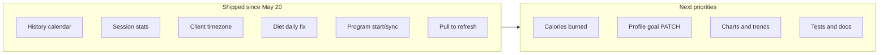

# SetFuel — Project Status Report

| | |
|---|---|
| **Original baseline** | 2026-05-20 (`37ad1f5`) |
| **Last updated** | 2026-05-29 |
| **Scope** | `mobile/` + `backend/` vs. product goal: workout + calorie tracking, persistent history, session/day stats, long-term progress analysis |
| **Method** | Code/schema inspection; E2E claims require UI → service → API → DB in **API mode** (`EXPO_PUBLIC_USE_LOCAL=false`) unless noted |

---

## At a glance — baseline vs today

| Metric | 2026-05-20 | 2026-05-29 (now) | Δ |
|--------|------------|------------------|---|
| **Overall completion (full stated goal)** | ~48% | **~72%** | +24 pts |
| **Production slice** (sign in + log today + cloud history) | ~70% | **~88%** | +18 pts |
| **Workout history (read path)** | Not shipped | **Shipped** | ✅ |
| **Session-wise stats** | Not shipped | **Shipped** (duration, sets, volume) | ✅ |
| **Diet “today” accuracy** | Broken in API mode | **Fixed** | ✅ |
| **Client timezone on date APIs** | UTC-only | **Shipped** | ✅ |
| **Calories burned** | Not started | **Not started** | — |
| **Long-term charts / PRs / trends** | Not started | **Not started** | — |

---

## Progress since 2026-05-20

Use this section as the **changelog against the original report**. Items marked ✅ were called out as missing or broken on 2026-05-20 and are now implemented (see `RELEASE_NOTES.md` **1.2.2** and commits after `37ad1f5`).

### Shipped (high impact)

| # | Area | What changed | Where to look |
|---|------|--------------|---------------|
| ✅ | **History tab** | Fourth main tab: month calendar, dots for workout/meal days, slide-in day detail | `MainTabNavigator.tsx`, `HistoryCalendarScreen.tsx`, `HistoryDayDetailScreen.tsx` |
| ✅ | **History API** | `GET /history/calendar`, `GET /history/day` with per-day sessions, meals, diet summary | `backend/src/routes/v1/history.ts` |
| ✅ | **Session history API** | `GET /sessions?from=&to=` (with stats), `GET /sessions/:id` | `backend/src/routes/v1/sessions.ts`, `workoutStats.ts` |
| ✅ | **Session stats** | Duration, exercise count, sets completed/total, volume (kg·rep) on history day cards | `HistoryDayDetailScreen.tsx`, `computeSessionStats()` |
| ✅ | **Timezone-aware dates** | Mobile sends `timeZone` / offset; backend buckets “today” and calendar days in user local time | `clientTimeZone.ts` (mobile + backend), meals/sessions/user/history routes |
| ✅ | **Diet daily UX** | Ring/totals from `getDailySummary()`; meal list filtered to **today**; profile load decoupled from meals | `DietTrackerScreen.tsx`, `mealService.ts` |
| ✅ | **Workout program flow** | Per-card Start/End + confirm modal; auto-load program into session; per-card active state; race guards | `WorkoutTrackerScreen.tsx` |
| ✅ | **Program ↔ session sync** | Edits while a program workout is active sync to session and loaded program | `WorkoutTrackerScreen.tsx` |
| ✅ | **Calendar UX** | Empty days not tappable; copy explains “logged days only” | `HistoryCalendarScreen.tsx` |
| ✅ | **Pull-to-refresh** | Home dashboard + History calendar refetch | `HomeScreen.tsx`, `HistoryCalendarScreen.tsx` |
| ✅ | **Local dev auth** | `EXPO_PUBLIC_USE_LOCAL=true` skips Google in native dev builds (EAS still uses production auth via `eas.json`) | `AuthContext.tsx` |

### Still open (unchanged from original gap list)

| # | Area | Status |
|---|------|--------|
| ⬜ | **Calories burned** | No schema, API, or UI |
| ⬜ | **Long-term analytics** | No weekly/monthly charts, PRs, streaks beyond day detail stats |
| ⬜ | **Profile/settings** | No `PATCH` for `goal_kcal`, display name, avatar |
| ⬜ | **Meal edit** | No `PATCH /meals/:id` |
| ⬜ | **Automated tests / CI** | Not observed |
| ⬜ | **Docs sync** | README / ARCHITECTURE may still lag code |
| ⬜ | **Normalized workout schema** | Still JSONB blob on `workout_session` |

### Commits since baseline (reference)

```text
b417cfb  feat: workout/diet history calendar + session stats
4cf84ff  fix: history back navigation
8033213  feat: workout session management / program tracking
e1f03f8  fix: no tap on empty calendar days
6e0a36f  fix: client timezone for history and daily summaries
6f9c8b2  feat: start workouts from program cards
d62fc53  fix: refine program card start actions
e2da6f6  feat: exercise management + program syncing
da8ec20  fix: diet daily nutrition
9f38899  feat: pull-to-refresh (home + history)
```

---

## Executive summary

| Metric | Value |
|--------|-------|
| **Overall completion (vs. full stated goal)** | **~72%** (was ~48%) |
| **Production-ready slice** (sign in + log today + browse past days in cloud) | **~88%** (was ~70%) |
| **Core gap (remaining)** | **Calories burned**, **trend/PR analytics**, **profile goal editing**, **tests & doc hygiene** |

The app is no longer “write-only” for workouts: users can **open the History tab**, see **which days had activity**, and drill into **session stats + meals for that day**. Diet and dashboard “today” semantics align with the **device timezone** when API mode is on.

---

## Goal mapping

| Stated goal | Status (2026-05-29) | Notes |
|-------------|---------------------|-------|
| Track workouts per gym session | **Done (active + programs)** | Start/end per program card, debounced sync, program load/sync |
| Track calories **intake** per day | **Mostly done** | `getDailySummary()` + today-only list on Diet; server uses client TZ |
| Track calories **burned** per session/day | **Not started** | No schema, API, or UI |
| View workout **history** anytime | **Done (calendar + day panel)** | History tab; `GET /history/*` + day detail with sessions |
| Persistent historical fitness data | **Mostly done** | Read path for workouts/meals by day; no global “all sessions” list screen |
| Analyze progress (logs, summaries, stats) | **Partial** | Per-session stats on history day; Home dashboard unchanged in depth; no charts |

---

## Architecture overview

```text
┌─────────────────────────────────────────────────────────────────┐
│  mobile (Expo SDK 54, React Navigation, AuthContext)            │
│  Tabs: Home · Workout · Diet · History                          │
│  Services: workout, meal, user, history, api                    │
│  lib/clientTimeZone → appended on date-scoped API calls         │
│  Toggle: USE_LOCAL → stubs / local vs apiFetch + JWT            │
└───────────────────────────┬─────────────────────────────────────┘
                            │ HTTPS + Bearer JWT (when USE_LOCAL=false)
┌───────────────────────────▼─────────────────────────────────────┐
│  backend (Express, TypeScript, pino)                            │
│  POST /auth/google  ·  GET /health  ·  /v1/* (requireUser)    │
│  /history/calendar · /history/day · GET /sessions?from&to       │
│  lib/clientTimeZone + lib/workoutStats                          │
└───────────────────────────┬─────────────────────────────────────┘
                            │ pg
┌───────────────────────────▼─────────────────────────────────────┐
│  PostgreSQL (Neon) — app_user, workout_program,                 │
│  workout_session (JSONB exercises), meal                        │
└─────────────────────────────────────────────────────────────────┘
```

**State management:** Still screen-local `useEffect` / callbacks (no TanStack Query). Workout tab debounces patches (~550ms). History month load uses a **request-id guard** against stale responses.

**Session model:** One active session per user; ended sessions stored as JSONB; **stats computed in app layer** (`workoutStats.ts`) for list/detail/history responses.

---

## Module-wise completion

| Module | 2026-05-20 | 2026-05-29 | E2E in API mode? |
|--------|------------|------------|------------------|
| Authentication & identity | 88% | **90%** | Yes (+ local dev bypass) |
| Active workout session | 82% | **88%** | Yes |
| Workout programs / routines | 78% | **85%** | Yes |
| Meal / calorie **intake** | 65% | **82%** | Yes; daily UX fixed |
| Calorie **burned** | 0% | **0%** | N/A |
| Workout **history** & retrieval | 12% | **80%** | Calendar + day detail |
| Progress / analytics | 22% | **40%** | Session stats + dashboard; no trends |
| Infrastructure (Render, Neon, EAS) | 85% | **85%** | Unchanged |
| Documentation accuracy | 40% | **45%** | RELEASE_NOTES current; README may lag |

---

## 1. Completed features (functional E2E where applicable)

### Authentication & user-specific data
- Google Sign-In (EAS APK / dev client); JWT on `/v1/*`.
- **Local dev:** `USE_LOCAL` bypasses Google in native dev when env says so; EAS preview/production keep `EXPO_PUBLIC_USE_LOCAL=false`.

### Active workout tracking (API mode)
- Start/end session, exercises, sets, reps/kg, done toggle; debounced sync.
- **Program cards:** Start/End per program, confirmation modal, auto-load exercises, dedupe/race guards, sync manual adds with loaded program.

### Programs (API mode)
- Full CRUD; bundled seed helper unchanged.

### Meal intake (API mode)
- CRUD + **`GET /meals/daily-summary`** wired on Diet screen.
- Today’s meal list filtered client-side by local date key; macros optional in modal; delete confirm; pull-to-refresh + focus refresh.

### History & session retrieval (API mode) — **new since baseline**
- **`GET /history/calendar`** — month range, workout/meal flags per day.
- **`GET /history/day`** — sessions (with stats), meals, diet summary for one date.
- **`GET /sessions?from=&to=`** — completed sessions in range with stats.
- **`GET /sessions/:id`** — single session with stats.
- **Mobile:** History tab, calendar UI, `HistoryDayDetailPanel` (slide-over), read-only exercise rows.

### Dashboard (API mode)
- `GET /v1/user/dashboard-summary` with **client timezone** for “today” meals.
- **Pull-to-refresh** on Home.

### Operations
- Health, migrations, Render + Neon + EAS path unchanged.

---

## 2. Partially implemented

| Area | What works | What’s still missing |
|------|------------|----------------------|
| **Calorie intake history** | Past days via History calendar + day meals | No dedicated “browse all meals” or date picker on Diet tab |
| **Progress / trends** | Per-session stats on history day; Home summary | No charts, PRs, streaks, weekly volume |
| **User goals** | `goal_kcal` in DB; dashboard + history day summary use it | No API/UI to **edit** goal |
| **Sessions list UI** | `listSessions()` exists in `historyService` | Not used as standalone list screen (calendar is primary UX) |
| **Programs (local mode)** | AsyncStorage | Diverges from API; History returns empty stubs when `USE_LOCAL` |
| **Docs** | `RELEASE_NOTES.md` through 1.2.2 | README/ARCHITECTURE may still describe pre-history state |
| **Offline / dual mode** | `USE_LOCAL` in services | Two behaviors to test |

---

## 3. Missing features (still critical for *full* stated goal)

1. **Calories burned** — estimate or manual; per session and daily rollup.
2. **Long-term analytics** — weekly/monthly trends, charts, personal records.
3. **Profile/settings API** — `PATCH` for `goal_kcal`, display name, avatar.
4. **Meal `PATCH`** — edit logged meals after the fact.
5. **Pagination** on `GET /meals` — still unbounded for power users.
6. **Normalized workout schema (optional)** — for SQL-native aggregates.
7. **Automated tests & CI** — not in repo review.
8. **README / ARCHITECTURE** — align with History tab, timezone, history routes.

---

## 4. Backend status

### API completeness

| Domain | Routes | History / analytics |
|--------|--------|---------------------|
| Auth | `POST /auth/google` | — |
| User | `GET /user/profile`, `GET /user/dashboard-summary` | TZ-aware today summary |
| Programs | CRUD `/programs` | — |
| Sessions | `GET /active`, `GET /?from&to`, `GET /:id`, `POST /`, end, exercises/sets | **Stats on list/detail** |
| History | `GET /history/calendar`, `GET /history/day` | **Primary read model for calendar UX** |
| Meals | `GET|POST /`, `DELETE /:id`, `GET /daily-summary` | TZ-aware daily summary |
| Exercises / Sets | Active session mutations | — |

### Database readiness

Unchanged: `workout_session.exercises` JSONB; no `calories_burned` table. Fine for MVP; weak for SQL-only analytics without JSON parsing.

---

## 5. Mobile app status

### Screens

| Screen | Role | API integration |
|--------|------|-----------------|
| `LoginScreen` | Google / local dev | E2E on EAS; local bypass in dev |
| `HomeScreen` | Dashboard + tips | E2E + **pull-to-refresh** |
| `WorkoutTrackerScreen` | Programs + active session | E2E + program start/sync |
| `DietTrackerScreen` | Today’s meals + log modal | E2E; **daily summary + today filter** |
| `HistoryCalendarScreen` | Month grid + day detail | E2E when not `USE_LOCAL` |

### Services (`USE_LOCAL=false`)

| Service | API wired? |
|---------|------------|
| `workoutService` | Yes — active session + programs |
| `mealService` | Yes — CRUD + **`getDailySummary()` used by Diet** |
| `userService` | Yes — profile + dashboard |
| `historyService` | Yes — calendar, day detail, session list/detail |

---

## 6. API integration status

| Flow | Status |
|------|--------|
| Sign-in → JWT → `apiFetch` | Complete |
| Workout start → mutate → end → Neon | Complete |
| Reload → resume active session | Complete |
| Reload → **browse past days (calendar)** | **Complete** |
| Diet log → **correct today total on Diet** | **Complete** |
| Home refresh after workout/meal | **Complete** (manual pull) |
| Timezone-correct dots / “today” | **Complete** (API mode) |

---

## 7. Verification against specific requirements

### Workout session tracking
- **Active session:** Complete E2E.
- **Ended sessions:** Persisted and **browsable** via History.

### Exercise logging
- Complete for active session; **read-only** on history day detail.

### Calories tracking
- **Intake:** Log/delete + **accurate daily on Diet** — yes (API mode).
- **Burned:** Not implemented.

### Historical workout retrieval
- **Backend:** List range + day bundle + single session — yes.
- **Mobile:** History tab — yes.

### User progress / stats analytics
- **Partial:** session stats on history day; Home dashboard coarse fields; **no trends**.

### CRUD operations

| Entity | Create | Read | Update | Delete | Notes |
|--------|--------|------|--------|--------|-------|
| Programs | ✓ | ✓ | ✓ | ✓ | |
| Active workout | ✓ | ✓ | ✓ | ✓ (end) | |
| Past workout | ✓ | ✓ | — | — | Via history/day + sessions |
| Meals | ✓ | ✓ (today on Diet; all in API) | ✗ | ✓ | |
| User profile | ✓ | ✓ | ✗ | ✗ | |

### Daily history / long-term progress

| Capability | 2026-05-20 | 2026-05-29 |
|------------|------------|------------|
| Daily workout history (UI) | No | **Yes** (calendar) |
| Session-wise stats | No | **Yes** (on day detail) |
| Long-term progress tracking | No | **No** (no charts/trends) |
| Persistent storage | Yes | Yes |
| Real-time sync during session | Yes | Yes |

---

## 8. Bugs / issues

### Fixed since 2026-05-20 ✅

| Was | Resolution |
|-----|------------|
| Diet totals used **all meals** | Uses `getDailySummary()` + today-only list |
| Diet ignored server `goal_kcal` | Summary from API includes goal |
| No workout history API/UI | History routes + History tab |
| Calendar wrong day / missing dots (TZ) | `clientTimeZone` on mobile + backend |
| Program card state leaked to all cards | Per-program `programsAddedToSession` |
| Program load race / duplicates | Ref guards + dedupe |
| `USE_LOCAL` ignored in dev client | AuthContext respects env in native dev |

### Still open

| Severity | Issue |
|----------|--------|
| **High** | No **calories burned** tracking |
| **Medium** | No **profile PATCH** / in-app goal edit |
| **Medium** | README / ARCHITECTURE may be outdated |
| **Medium** | `USE_LOCAL` defaults true in code — must set `.env` / `eas.json` for prod |
| **Low** | No meal `PATCH`; `listSessions` unused in UI |
| **Low** | `DashboardSummary` type may omit fields returned by API |
| **Ops** | Render cold start; manual migrations |

---

## 9. Scalability & architectural concerns

1. **JSONB session blob** — Still fine for MVP; history stats computed in Node, not SQL aggregates.
2. **No pagination** on `GET /meals` — Still relevant as data grows.
3. **No global server cache** — Pull-to-refresh mitigates stale Home/History; Workout still screen-local.
4. **Monorepo docs drift** — Partially improved via RELEASE_NOTES; root docs may need pass.
5. **Dual mode (`USE_LOCAL`)** — History/diet stubs empty in local mode by design.

---

## 10. Recommended next steps (priority order)

| P | Task | Effort | Status |
|---|------|--------|--------|
| ~~1~~ | ~~Fix Diet daily UX~~ | S | **Done** |
| ~~2~~ | ~~`GET /sessions` history~~ | M | **Done** |
| ~~3~~ | ~~History screen (calendar + day detail)~~ | M | **Done** |
| ~~4~~ | ~~Session summary (duration, volume, sets)~~ | M | **Done** |
| **1** | **Calories burned** — schema + manual or MET estimate; dashboard rollup | L | Open |
| **2** | **`PATCH /user/profile`** — `goal_kcal`, name; settings screen | S | Open |
| **3** | **Progress views** — weekly volume, frequency, kcal trends (Home or new tab) | L | Open |
| **4** | **Meal `PATCH`** + optional macro edit in modal | S | Open |
| **5** | **Update README + ARCHITECTURE** (History tab, timezone, routes) | S | Open |
| **6** | **API tests + seed script** | M | Open |
| **7** | **Pagination** on meals list / history queries | S | Open |
| **8** | **Normalized sets table** (only if heavy SQL analytics planned) | XL | Open |

**Effort key:** S ≤1 day · M 2–4 days · L ~1 week · XL multi-week.

---

## 11. Estimated effort to reach full stated goal

| Milestone | Scope | Estimate (solo dev) |
|-----------|--------|---------------------|
| ~~**MVP+**~~ | Diet daily + history list/detail | **Delivered** (2026-05-27–29) |
| **Core product** | + burned calories + profile goals + basic trends | **~2–3 weeks** |
| **Full vision** | + charts, meal edit, tests, schema hardening | **~4–7 weeks** |

**Overall completion today:** ~**72%** of full vision; ~**88%** of “log today and review past days in the cloud.”

---

## 12. What “done” looks like for your original goal

Checklist — compare to **2026-05-20** column mentally: newly checked items were open on the baseline report.

- [x] Log exercises/sets during a gym session (cloud)
- [x] Sign in; data scoped to user
- [x] Log calorie **intake** (cloud)
- [x] Accurate **per-day** intake on Diet UI *(fixed 2026-05-27)*
- [ ] Log or derive calorie **burned**
- [x] Open **any past day’s** workout *(History calendar + day panel)*
- [x] Session stats (duration, volume, sets, etc.) *(on history day detail)*
- [ ] Long-term progress views (charts, trends, PRs — not just day/session stats)
- [ ] Consistent docs and env for production vs local dev *(RELEASE_NOTES yes; README TBD)*

---

## 13. Visual roadmap (remaining vs done)



---

*Baseline report: 2026-05-20. This revision: 2026-05-29. Re-run after burned calories, profile settings, or analytics ship.*
