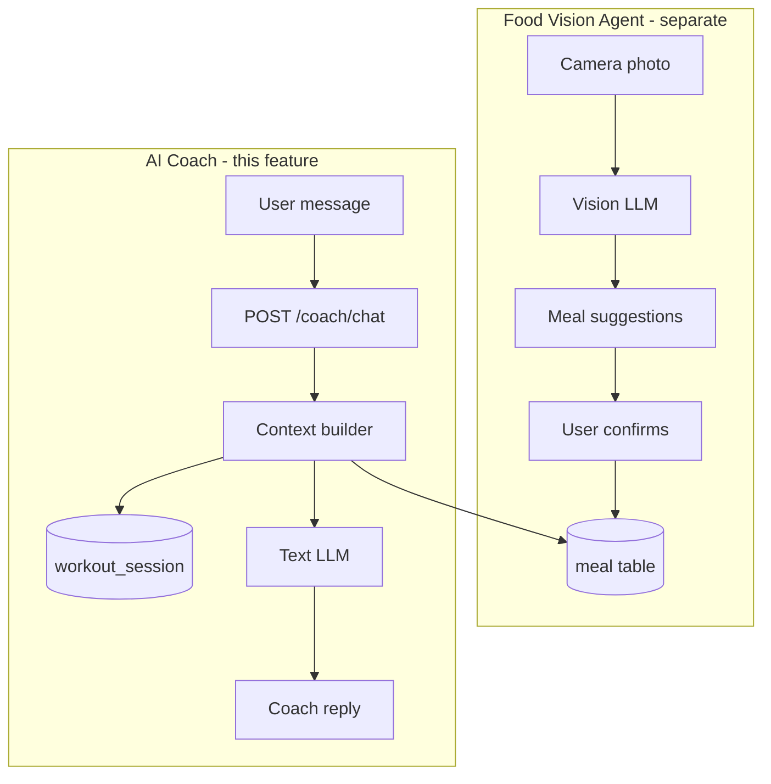
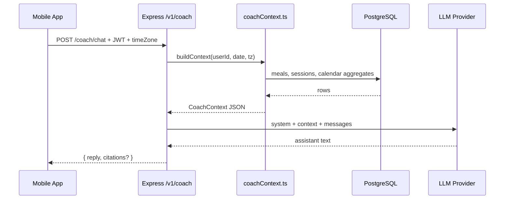

# SetFuel AI Coach — Feature Specification

| | |
|---|---|
| **Status** | Planned (not implemented) |
| **Last updated** | 2026-05-29 |
| **Owner** | Product / engineering |
| **Related docs** | [ai-food-agent.txt](./ai-food-agent.txt) (vision-based meal logging), [ARCHITECTURE.md](../ARCHITECTURE.md), [STATUS_REPORT.md](../STATUS_REPORT.md) |

---

## Table of contents

1. [Executive summary](#1-executive-summary)
2. [Problem and goals](#2-problem-and-goals)
3. [Relationship to other AI features](#3-relationship-to-other-ai-features)
4. [Product vision](#4-product-vision)
5. [User experience](#5-user-experience)
6. [System architecture](#6-system-architecture)
7. [Coach context (data contract)](#7-coach-context-data-contract)
8. [API specification](#8-api-specification)
9. [Backend implementation](#9-backend-implementation)
10. [Mobile implementation](#10-mobile-implementation)
11. [Database schema (optional phases)](#11-database-schema-optional-phases)
12. [LLM integration](#12-llm-integration)
13. [Prompt engineering](#13-prompt-engineering)
14. [Safety, privacy, and compliance](#14-safety-privacy-and-compliance)
15. [Cost, rate limits, and reliability](#15-cost-rate-limits-and-reliability)
16. [Phased rollout plan](#16-phased-rollout-plan)
17. [Testing strategy](#17-testing-strategy)
18. [Observability and operations](#18-observability-and-operations)
19. [Future enhancements](#19-future-enhancements)
20. [Open decisions](#20-open-decisions)
21. [Appendix: codebase references](#21-appendix-codebase-references)

---

## 1. Executive summary

**SetFuel AI Coach** is a server-orchestrated conversational assistant that answers questions and offers suggestions based on **the authenticated user’s real workout and diet data** stored in PostgreSQL—not generic fitness advice disconnected from what they logged.

The coach:

- Reads **today’s meals**, **macros**, **calorie goal**, **workout sessions**, and **recent history** (calendar aggregates, last session stats).
- Respects the user’s **local timezone** (same semantics as Diet, History, and dashboard APIs).
- Returns **grounded** responses: numbers and exercise names must come from provided context; when data is missing, the coach says so and nudges logging instead of inventing entries.
- Runs **entirely on the backend** so API keys stay secret, context is consistent with the dashboard, and rate limits protect cost.

**Recommended delivery order:** Daily Brief (Home card) → Chat tab → Tool-augmented queries → Proactive notifications.

This document is the implementation blueprint. Code does not exist yet; all paths and types below are **proposed** unless marked as *existing*.

---

## 2. Problem and goals

### 2.1 Problem

Users log workouts and meals in SetFuel but must **interpret** the data themselves:

- “Am I on track for calories today?”
- “Did I train enough volume this week?”
- “What should I eat given I trained legs this morning?”

The app already surfaces **dashboard summary** and **history day detail**, but not **natural-language guidance** tied to personal logs.

### 2.2 Goals

| ID | Goal | Success metric |
|----|------|----------------|
| G1 | Personalized insights from **logged** data | Coach cites real kcal/macros/session stats in replies |
| G2 | Fast, trustworthy answers | p95 latency &lt; 8s (non-streaming MVP); no fabricated meals/sets |
| G3 | Fits existing architecture | New `coach` routes + `coachService`; reuses `requireUser`, timezone, pool |
| G4 | Safe coaching boundaries | Clear non-medical disclaimer; no extreme diet praise |
| G5 | Controlled cost | Rate limits + optional daily-brief cache |

### 2.3 Non-goals (v1)

- Replacing a registered dietitian, doctor, or physical therapist.
- Generating workout programs from scratch without user programs as input (v2+ may suggest tweaks).
- Image / vision analysis (see [ai-food-agent.txt](./ai-food-agent.txt)).
- Calories **burned** estimation (not in schema yet per [STATUS_REPORT.md](../STATUS_REPORT.md)).
- Training on user data for a custom model (use commercial LLM APIs with zero-retention where possible).

---

## 3. Relationship to other AI features

SetFuel may host **two distinct AI systems**:

| Dimension | AI Food Agent (vision) | AI Coach (this doc) |
|-----------|------------------------|---------------------|
| **Input** | Meal photo | Text (+ optional date) |
| **Output** | Structured meal candidates → user confirms → DB | Natural language insights |
| **Models** | Vision LLM (e.g. GPT-4o, Llama Vision) | Text LLM (e.g. GPT-4o-mini, Claude Haiku/Sonnet) |
| **Writes DB** | Yes (`meal` rows after confirmation) | No (read-only on user data in v1) |
| **Doc** | [ai-food-agent.txt](./ai-food-agent.txt) | This file |

**Future convergence:** After a vision meal is confirmed, the coach can answer “How does this meal fit my day?” by including that meal in `CoachContext`—no merge of the two pipelines required at launch.



---

## 4. Product vision

### 4.1 Positioning

**“Your gym and kitchen data, explained.”**

The coach is not a general chatbot. It is a **read-only analyst** over SetFuel logs with a **supportive coach tone**: short, actionable, specific.

### 4.2 Example interactions

| User message | Expected behavior |
|--------------|-------------------|
| “How am I doing today?” | Summarize today kcal vs `goal_kcal`, macros, workouts completed, 1–2 suggestions |
| “Am I eating enough protein?” | Compare today protein to a simple target (e.g. 0.8g/lb placeholder until profile goals exist) **only if** macro data exists on meals |
| “What did I do in my last workout?” | Use last ended session: exercises, sets completed, volume, duration |
| “Compare this week to last week” | Use calendar aggregates (workout days, meal days); admit limits if &lt; 7 days of data |
| “Should I train today?” | Use `lastWorkoutDaysAgo` + recent calendar; no medical clearance advice |

### 4.3 Personas (tone)

Pick one default in [§20 Open decisions](#20-open-decisions):

- **Analyst** — neutral, bullet facts, minimal encouragement.
- **Gym buddy** (recommended default) — concise, motivating, still data-grounded.

---

## 5. User experience

### 5.1 Surface options

| Option | Description | Phase |
|--------|-------------|-------|
| **A. Daily Brief card** | Home screen card: 3–5 auto-generated bullets once per local day | Phase 1 |
| **B. Coach tab** | Fifth tab or stack screen: chat UI + suggested prompts | Phase 2 |
| **C. Contextual entry** | “Ask coach about this day” from `HistoryDayDetailScreen` with `date` prefilled | Phase 3 |

**Recommendation:** Ship **A** first to validate context quality and prompts; then **B**.

### 5.2 Daily Brief (Phase 1)

**Placement:** `HomeScreen`, below existing dashboard cards (same `dashboard` theme as Home / Workout / Diet).

**Behavior:**

- On mount (and pull-to-refresh), call `GET /v1/coach/daily-brief`.
- Show loading skeleton → bullets or error with retry.
- “See full chat” CTA navigates to Coach screen (Phase 2).
- Cache on server per `(user_id, local_date)` to avoid repeated LLM calls.

**Empty / sparse data copy:**

- No meals today → “Log your first meal on the Diet tab for personalized nutrition tips.”
- No workouts this week → Encourage starting a session from Workout tab.

### 5.3 Coach chat (Phase 2)

**Layout:**

- Header: “Coach” + subtitle “Based on your SetFuel logs”
- Message list (user right, coach left; match app glass/dark theme)
- Suggested prompt chips above input (horizontal scroll)
- Text input + send; disable while request in flight
- Footer disclaimer (collapsible): not medical advice

**Suggested prompts (initial set):**

1. Summarize my day
2. How’s my nutrition vs my goal?
3. Review my last workout
4. What should I focus on tomorrow?
5. How active was I this week?

**Conversation:**

- v1: Client sends last **N** turns (e.g. 10) in request body; server does not require `conversationId`.
- v2: Server persists threads; client loads history on open.

### 5.4 Navigation integration

*Existing tabs:* Home · Workout · Diet · History (`MainTabNavigator.tsx`).

**Option 1 — Fifth tab “Coach”**  
Pros: discoverable. Cons: crowded tab bar.

**Option 2 — Stack screen from Home**  
`RootStack` → `CoachScreen`; Home brief card + header icon open chat.  
Pros: no tab bar change. Cons: slightly hidden.

**Option 3 — FAB on Home**  
Floating action opens coach modal.

Document decision in §20 before implementation.

### 5.5 Error and offline UX

| State | UX |
|-------|-----|
| Network error | Inline banner + retry on brief/chat |
| 429 rate limit | “You’ve reached today’s coach limit. Try again tomorrow.” |
| 503 LLM down | “Coach is temporarily unavailable. Your logs are safe—check back soon.” |
| `USE_LOCAL=true` | Hide coach or show static message: “Coach requires API mode.” |

Coach should **not** be offered in local-only dev mode unless a mock coach is implemented for UI work.

---

## 6. System architecture

### 6.1 High-level diagram



### 6.2 Design principles

1. **Server-side context only** — Mobile never assembles full history for the model.
2. **Small context window** — Target &lt; 3 KB JSON (~800–1200 tokens) before conversation history.
3. **Same timezone rules** — Reuse `getClientTimeZone`, `getLocalDateExpr`, `appendClientTimeZone` patterns.
4. **Read-only on fitness data** — Coach routes do not INSERT/UPDATE meals or sessions in v1.
5. **Separation of concerns** — `coachContext.ts` (SQL), `coachLlm.ts` (provider), `coach.ts` (HTTP).

### 6.3 Component map

```text
backend/src/
  routes/v1/coach.ts          # HTTP handlers
  lib/coachContext.ts         # SQL → CoachContext
  lib/coachLlm.ts             # Provider adapter
  lib/coachPrompts.ts         # System prompts (optional split)
  middleware/coachRateLimit.ts  # optional per-user limits

mobile/src/
  screens/coach/CoachScreen.tsx
  screens/coach/components/     # MessageBubble, PromptChips, BriefCard
  services/coachService.ts
  types/coach.ts
```

---

## 7. Coach context (data contract)

The context object is the **single source of truth** passed to the LLM (as JSON or compressed markdown). All coach answers must be traceable to fields here.

### 7.1 TypeScript shape (proposed)

```typescript
/** Compact stats — mirrors backend computeSessionStats */
type CoachSessionSummary = {
  id: string;
  startedAt: string;       // ISO
  endedAt: string;           // ISO
  durationMinutes: number | null;
  exerciseCount: number;
  setsCompleted: number;
  setCount: number;
  volumeKg: number;
  /** Top 5 exercise names by set count */
  exercises: string[];
};

type CoachMealSummary = {
  id: string;
  name: string;
  kcal: number;
  time: string;
  macros?: { protein: number; carbs: number; fats: number };
};

type CoachDayDiet = {
  totalKcal: number;
  goalKcal: number;
  nutritionProgress: number; // 0–1
  mealsLogged: number;
  macros: { protein: number; carbs: number; fats: number };
  meals: CoachMealSummary[];
};

type CoachContext = {
  generatedAt: string;       // ISO UTC
  focusDate: string;         // YYYY-MM-DD in user TZ
  timeZone: string;

  user: {
    displayName: string;
    goalKcal: number;
    // future: goalProteinG, trainingGoal: 'cut' | 'bulk' | 'maintain'
  };

  today: {
    diet: CoachDayDiet;
    workouts: CoachSessionSummary[];
    hasActiveSession: boolean; // from GET /sessions/active if needed
  };

  recent: {
    /** Last 7 local days inclusive */
    workoutDays: number;
    mealLoggingDays: number;
    lastWorkout: {
      daysAgo: number;
      volumeKg: number;
      durationMinutes: number | null;
      topExercises: string[];
    } | null;
    /** Optional: avg kcal on days with meals */
    avgDailyKcalLast7: number | null;
  };

  dataQuality: {
    mealsLoggedToday: number;
    workoutsLoggedToday: number;
    hasMacroDataOnMealsToday: boolean;
    warnings: string[];  // e.g. "No meals logged today"
  };
};
```

### 7.2 Context builder logic

**File:** `backend/src/lib/coachContext.ts`  
**Function:** `buildCoachContext(pool, userId, req, focusDate?: string): Promise<CoachContext>`

| Field | Source (*existing* code to reuse) |
|-------|-----------------------------------|
| `user.displayName`, `goalKcal` | `app_user` — same as `user.ts` profile/dashboard |
| `today.diet` | Same queries as `GET /history/day` for `focusDate` (default: today in client TZ) |
| `today.workouts` | Sessions on that day from `history/day` query + `computeSessionStats()` |
| `recent.workoutDays` / `mealLoggingDays` | Aggregate from `history/calendar` for `[today-6, today]` |
| `recent.lastWorkout` | Latest `workout_session` with `ended_at` + stats |
| `recent.avgDailyKcalLast7` | Group meals by day over 7 days (new SQL, similar to calendar) |
| `dataQuality.warnings` | Rules engine (see below) |

**Data quality rules (examples):**

```typescript
if (mealsLoggedToday === 0) warnings.push('No meals logged for focus date.');
if (!hasMacroDataOnMealsToday && mealsLoggedToday > 0)
  warnings.push('Meals lack macro breakdown; protein advice may be limited.');
if (workoutDays === 0 && focusDate is today)
  warnings.push('No completed workouts in the last 7 days.');
```

### 7.3 Context size budget

| Section | Max items |
|---------|-----------|
| `today.diet.meals` | 20 (truncate with `mealsLogged` count) |
| `today.workouts` | 5 sessions |
| `exercises` per session | 5 names |
| Conversation history (chat only) | 10 turns × ~500 chars |

If over budget, truncate oldest meals first; keep totals/macros complete.

### 7.4 Markdown alternative for LLM

Some teams send context as markdown instead of raw JSON:

```markdown
## User
- Name: Alex
- Calorie goal: 2500 kcal

## Today (2026-05-29, America/Los_Angeles)
### Diet
- 1420 / 2500 kcal (57%)
- Protein 98g | Carbs 120g | Fat 45g
- Meals: Greek Yogurt Bowl (420), ...
### Workouts
- Push Day: 52 min, 12 sets, volume 4200 kg, exercises: Bench, OHP, ...
```

Either JSON or markdown is fine; **pick one** and stay consistent in prompts.

---

## 8. API specification

All routes live under `/v1/coach`, protected by `requireUser` (same as meals/sessions). Register in `backend/src/routes/v1/index.ts`.

### 8.1 `GET /v1/coach/daily-brief`

**Purpose:** One-shot insights for Home card (Phase 1).

**Query params:**

| Param | Required | Description |
|-------|----------|-------------|
| `timeZone` | Recommended | IANA TZ — same as history/meals |
| `tzOffsetMinutes` | Recommended | Fallback |
| `date` | No | `YYYY-MM-DD`; default today in client TZ |

**Response `200`:**

```json
{
  "date": "2026-05-29",
  "brief": [
    "You're at 1,420 of 2,500 kcal (57%) with dinner still to log.",
    "Protein is 98g so far — aim for 30–40g at your next meal if you're targeting ~150g/day.",
    "Last workout was 2 days ago (Push, 52 min, 4,200 kg volume).",
    "This week: 3 workout days and 5 days with meals logged."
  ],
  "generatedAt": "2026-05-29T18:00:00.000Z",
  "cached": true
}
```

**Caching:** Store brief text + `generatedAt` keyed by `(user_id, date)`. Invalidate when user adds meal or ends workout on that day (Phase 2 optimization); MVP can use TTL 4–6 hours.

**Errors:** `400` invalid date, `429` rate limit, `503` LLM failure.

---

### 8.2 `POST /v1/coach/chat`

**Purpose:** Multi-turn conversation (Phase 2).

**Request body:**

```json
{
  "message": "How did my last workout compare to this week?",
  "date": "2026-05-29",
  "history": [
    { "role": "user", "content": "Summarize my day" },
    { "role": "assistant", "content": "..." }
  ]
}
```

| Field | Type | Required | Notes |
|-------|------|----------|-------|
| `message` | string | Yes | 1–2000 chars |
| `date` | string | No | Focus date for context |
| `history` | array | No | Max 10 turns; roles `user` \| `assistant` only |

**Response `200`:**

```json
{
  "reply": "Your last workout was 2 days ago...",
  "focusDate": "2026-05-29",
  "citations": [
    { "type": "session", "id": "sess_abc", "label": "Push Day" },
    { "type": "meal", "id": "meal_xyz", "label": "Greek Yogurt Bowl" }
  ],
  "usage": {
    "promptTokens": 1200,
    "completionTokens": 180
  }
}
```

`citations` optional in MVP; enables future deep links to History day / meal row.

**Errors:**

| Status | Body |
|--------|------|
| `400` | `{ "message": "message is required" }` |
| `429` | `{ "message": "Daily coach message limit reached" }` |
| `503` | `{ "message": "Coach temporarily unavailable" }` |

---

### 8.3 `GET /v1/coach/conversations` (Phase 2b — optional)

List persisted threads when DB tables exist.

---

### 8.4 Version discovery

Add to `GET /v1` route list in `index.ts`:

```text
GET  /coach/daily-brief
POST /coach/chat
```

---

## 9. Backend implementation

### 9.1 New dependencies

Add to `backend/package.json` (exact package TBD in §20):

- `openai` **or** `@anthropic-ai/sdk`
- Optional: `zod` for request validation (if not already used)

**Environment variables** (`backend/.env.example`):

```bash
# AI Coach (text LLM)
COACH_LLM_PROVIDER=openai          # openai | anthropic
OPENAI_API_KEY=sk-...
OPENAI_MODEL=gpt-4o-mini           # daily brief + chat default
ANTHROPIC_API_KEY=                 # if provider=anthropic
ANTHROPIC_MODEL=claude-3-5-haiku-latest

COACH_DAILY_MESSAGE_LIMIT=30       # per user per local day
COACH_BRIEF_CACHE_TTL_HOURS=6
COACH_REQUEST_TIMEOUT_MS=25000
```

### 9.2 `coachContext.ts`

Pseudocode:

```typescript
export async function buildCoachContext(
  userId: string,
  req: Request,
  focusDate?: string,
): Promise<CoachContext> {
  const timeZone = getClientTimeZone(req);
  const date = focusDate ?? todayInTimeZone(timeZone);
  // Parallel queries: profile, day detail, calendar 7d, last session
  // Map to CoachContext + dataQuality.warnings
}
```

**Reuse:**

- `getLocalDateExpr` from `backend/src/lib/clientTimeZone.ts`
- `computeSessionStats`, `parseExercises` from `backend/src/lib/workoutStats.ts`
- SQL patterns from `backend/src/routes/v1/history.ts` and `user.ts`

### 9.3 `coachLlm.ts`

Responsibilities:

- `generateDailyBrief(context: CoachContext): Promise<string[]>`
- `generateChatReply(context: CoachContext, message: string, history: Message[]): Promise<{ reply: string; citations?: Citation[] }>`
- Timeout via `AbortSignal`
- Map provider errors to `503`
- **Never** log full API keys; log `userId`, token counts, latency

### 9.4 `coach.ts` router

```typescript
coachRouter.get('/daily-brief', ...);
coachRouter.post('/chat', ...);
```

Apply rate limit middleware before handler.

### 9.5 Rate limiting

| Limit | Value (suggested) |
|-------|-------------------|
| Chat messages per user per local day | 30 |
| Daily brief generations per user per day | 5 (rest served from cache) |
| Max `message` length | 2000 chars |
| Max `history` turns | 10 |

Implementation options:

- In-memory `Map` (dev only)
- Postgres table `coach_rate_limit` (user_id, date, count)
- Redis (if introduced later)

### 9.6 Caching daily brief

**Table (optional):** `coach_daily_brief_cache`

| Column | Type |
|--------|------|
| user_id | BIGINT FK |
| local_date | DATE |
| bullets | JSONB |
| context_hash | TEXT | optional: invalidate when meals/sessions change |
| created_at | TIMESTAMPTZ |

---

## 10. Mobile implementation

### 10.1 Types — `mobile/src/types/coach.ts`

```typescript
export type CoachBrief = {
  date: string;
  brief: string[];
  generatedAt: string;
  cached?: boolean;
};

export type CoachMessage = {
  id: string;
  role: 'user' | 'assistant';
  content: string;
  createdAt: string;
};

export type CoachChatResponse = {
  reply: string;
  focusDate: string;
  citations?: { type: 'session' | 'meal'; id: string; label: string }[];
};
```

Export from `mobile/src/types/index.ts`.

### 10.2 Service — `mobile/src/services/coachService.ts`

```typescript
import { appendClientTimeZone } from '../lib/clientTimeZone';
import { apiFetch, USE_LOCAL } from './api';

export async function getDailyBrief(date?: string): Promise<CoachBrief> {
  if (USE_LOCAL) throw new Error('Coach requires API mode');
  const q = appendClientTimeZone(new URLSearchParams());
  if (date) q.set('date', date);
  return apiFetch<CoachBrief>(`/coach/daily-brief?${q}`);
}

export async function sendCoachMessage(
  message: string,
  history: { role: 'user' | 'assistant'; content: string }[],
  date?: string,
): Promise<CoachChatResponse> {
  if (USE_LOCAL) throw new Error('Coach requires API mode');
  return apiFetch<CoachChatResponse>('/coach/chat', {
    method: 'POST',
    body: { message, history, date },
  });
}
```

Append `timeZone` on POST via header or body—**match** how other routes receive TZ (query on GET; for POST, include in body or use shared header helper if added).

### 10.3 Screens

| File | Responsibility |
|------|----------------|
| `CoachScreen.tsx` | Chat UI, message state, send handler |
| `DailyBriefCard.tsx` | Home embed; loading/error/bullets |
| `CoachPromptChips.tsx` | Suggested prompts |

**State:** Local `useState` for messages in v1; consider `useReducer` if streaming added.

### 10.4 Home integration

In `HomeScreen.tsx`:

- Fetch `getDailyBrief()` alongside `getDashboardSummary()` in parallel (`Promise.allSettled`).
- Do not block dashboard if brief fails.
- Pull-to-refresh includes brief refetch.

### 10.5 Styling

Use existing `dashboard` theme tokens (`mobile/src/theme`) for consistency with Home, Workout, Diet, History.

### 10.6 Feature flag

Optional `EXPO_PUBLIC_COACH_ENABLED=true` in `mobile/.env.example` to hide UI until backend is deployed.

---

## 11. Database schema (optional phases)

### 11.1 Phase 1 — No new tables

Daily brief cache can live in memory or a simple table; chat is stateless.

### 11.2 Phase 2 — Conversation persistence

**Migration:** `backend/sql/004_coach.sql`

```sql
CREATE TABLE IF NOT EXISTS coach_conversation (
  id TEXT PRIMARY KEY,
  user_id BIGINT NOT NULL REFERENCES app_user (id) ON DELETE CASCADE,
  title TEXT,
  created_at TIMESTAMPTZ NOT NULL DEFAULT now(),
  updated_at TIMESTAMPTZ NOT NULL DEFAULT now()
);

CREATE TABLE IF NOT EXISTS coach_message (
  id TEXT PRIMARY KEY,
  conversation_id TEXT NOT NULL REFERENCES coach_conversation (id) ON DELETE CASCADE,
  role TEXT NOT NULL CHECK (role IN ('user', 'assistant', 'system')),
  content TEXT NOT NULL,
  token_count INT,
  created_at TIMESTAMPTZ NOT NULL DEFAULT now()
);

CREATE INDEX IF NOT EXISTS idx_coach_message_conversation
  ON coach_message (conversation_id, created_at);

CREATE TABLE IF NOT EXISTS coach_daily_brief_cache (
  user_id BIGINT NOT NULL REFERENCES app_user (id) ON DELETE CASCADE,
  local_date DATE NOT NULL,
  bullets JSONB NOT NULL,
  created_at TIMESTAMPTZ NOT NULL DEFAULT now(),
  PRIMARY KEY (user_id, local_date)
);
```

### 11.3 Phase 3 — Audit log (optional)

`coach_request_log` for debugging (no PII in message text if policy requires minimization).

---

## 12. LLM integration

### 12.1 Provider selection

| Provider | Pros | Cons |
|----------|------|------|
| **OpenAI** `gpt-4o-mini` | Cheap, fast, good JSON discipline | Vendor lock-in |
| **Anthropic** Haiku | Strong safety refusals | Slightly different API |
| **Local Ollama** | Dev offline | Not for production mobile |

**Recommendation:** `gpt-4o-mini` for brief + chat MVP; upgrade to `gpt-4o` or Sonnet for complex weekly analysis if quality insufficient.

### 12.2 Request structure

```typescript
{
  model: config.openaiModel,
  messages: [
    { role: 'system', content: SYSTEM_PROMPT },
    { role: 'user', content: `USER_DATA:\n${contextJson}\n\nUSER_MESSAGE:\n${message}` },
    // ... prior turns
  ],
  temperature: 0.4,
  max_tokens: 600,
}
```

Low temperature reduces creative hallucination.

### 12.3 Structured output (optional)

Ask for JSON `{ "bullets": string[], "citations": [...] }` with `response_format: { type: 'json_object' }` for daily brief parsing reliability.

### 12.4 Streaming (Phase 2b)

`POST /coach/chat/stream` as SSE:

- Mobile: `fetch` + `ReadableStream` or EventSource polyfill
- Improves perceived latency
- Not required for MVP

---

## 13. Prompt engineering

### 13.1 System prompt (template)

```text
You are SetFuel Coach, a fitness and nutrition assistant inside the SetFuel app.

RULES:
1. Use ONLY facts from the USER_DATA block. Never invent meals, exercises, sets, or calories.
2. If USER_DATA warnings indicate missing logs, say so and suggest logging in the app (Diet or Workout tab).
3. Keep replies concise: prefer 3–6 bullets or 2–4 short paragraphs unless the user asks for detail.
4. Give actionable suggestions (what to eat next, recovery, consistency) grounded in their numbers.
5. You are NOT a doctor, dietitian, or physical therapist. Do not diagnose injuries or eating disorders.
6. Do not encourage extreme calorie restriction, purging, or dangerous training volumes.
7. Use the user's display name sparingly. Units: kcal, kg, minutes as in USER_DATA.

When comparing to goals, use goalKcal from USER_DATA. For protein targets without a user goal, you may mention general ranges but label them as general guidance, not prescription.
```

### 13.2 Daily brief user prompt

```text
Generate exactly 4 bullet insights for the user's dashboard card.
Each bullet max 120 characters.
Prioritize: calorie progress, macros (if available), last workout recency, weekly consistency.
If data is sparse, one bullet must encourage logging.
Return JSON: { "bullets": string[] }
```

### 13.3 Evaluation checklist (manual QA)

- [ ] Coach never cites a meal not in `today.diet.meals`
- [ ] Coach admits “no workouts logged” when `workouts` empty
- [ ] Changing timezone changes “today” consistently with Diet screen
- [ ] Asking about medical condition → redirects to professional
- [ ] Empty new user → encouraging onboarding, not fake stats

---

## 14. Safety, privacy, and compliance

### 14.1 Safety

| Risk | Mitigation |
|------|------------|
| Hallucinated logs | Grounding rules + low temperature + context-only policy |
| Medical advice | System prompt + UI disclaimer |
| Eating disorder triggers | Refuse weight-loss encouragement for underweight scenarios; avoid “skip meals” |
| Injury diagnosis | “Consult a professional if pain persists” |

### 14.2 Privacy

- LLM API calls include **minimum** PII: `displayName` optional; never send email to model.
- Prefer providers with **zero training** on API data (check vendor DPA).
- Do not send meal `image_uri` to text coach in v1.
- Log retention: 30 days for request metadata; message content logging policy TBD.

### 14.3 Auth

All coach endpoints require valid JWT (`requireUser` middleware)—same as `/v1/meals`.

---

## 15. Cost, rate limits, and reliability

### 15.1 Cost estimate (rough)

Assume ~1.5k input + 400 output tokens per chat turn, `gpt-4o-mini`:

- ~$0.0003–0.001 per message (verify current pricing)
- 30 messages/user/day × 1000 users → monitor monthly cap

**Daily brief** with cache: ≤5 LLM calls/user/day.

### 15.2 Reliability

| Failure | Behavior |
|---------|----------|
| LLM timeout (25s) | 503 + retry message |
| Invalid JSON from model | Retry once; fallback generic brief |
| DB down | 500; coach unavailable |

### 15.3 Circuit breaker (optional)

After N consecutive LLM failures, return cached brief or static fallback for 15 minutes.

---

## 16. Phased rollout plan

### Phase 1 — Daily Brief (MVP)

**Backend**

- [ ] `coachContext.ts`
- [ ] `coachLlm.ts` + env vars
- [ ] `GET /coach/daily-brief`
- [ ] In-memory or DB brief cache
- [ ] Rate limit brief generations

**Mobile**

- [ ] `coachService.getDailyBrief`
- [ ] `DailyBriefCard` on Home
- [ ] Hide when `USE_LOCAL`

**Exit criteria:** Brief matches dashboard kcal; 10 manual QA scenarios pass.

---

### Phase 2 — Chat

**Backend**

- [ ] `POST /coach/chat`
- [ ] Daily message rate limit
- [ ] Optional citations in response

**Mobile**

- [ ] `CoachScreen` + navigation
- [ ] Prompt chips
- [ ] Message list + loading states

**Exit criteria:** 20-question QA script; no hallucinated meals in stress test.

---

### Phase 3 — Contextual + persistence

- [ ] “Ask about this day” from History
- [ ] DB tables for conversations
- [ ] Brief cache invalidation on new meal/session
- [ ] Streaming responses

---

### Phase 4 — Advanced coach

- [ ] Tool calling: `getHistoryDay(date)`, `getSession(id)`
- [ ] Profile goals: protein target, cut/bulk (`PATCH /user/profile`)
- [ ] Calories burned in context (when feature ships)
- [ ] Push notification: “You're 800 kcal under goal”

---

## 17. Testing strategy

### 17.1 Backend unit tests

- `buildCoachContext` with fixture rows: empty day, full day, timezone edge (UTC+14).
- `dataQuality.warnings` rules.
- Rate limit counter reset at local midnight (mock clock).

### 17.2 Backend integration tests

- Hit `POST /coach/chat` with mocked LLM (inject `coachLlm` stub).
- Verify 401 without JWT.

### 17.3 Manual E2E (API mode)

1. Log meals on Diet → ask coach about protein → numbers match.
2. Complete workout → ask about volume → matches History day.
3. New user with no data → coach encourages logging.
4. 31st message → 429.

### 17.4 Prompt regression suite (optional)

Store golden `USER_DATA` fixtures + snapshot expected bullet themes (not exact wording).

---

## 18. Observability and operations

### 18.1 Logging (pino)

Child logger: `{ module: 'coach' }`

| Event | Level | Fields |
|-------|-------|--------|
| Brief generated | info | userId, date, latencyMs, cached |
| Chat completed | info | userId, promptTokens, completionTokens |
| LLM error | error | userId, err, provider |
| Rate limited | warn | userId |

### 18.2 Metrics (future)

- `coach_requests_total{endpoint,status}`
- `coach_llm_latency_seconds`
- `coach_tokens_total{direction}`

### 18.3 Feature launch checklist

- [ ] API keys in production secrets (not git)
- [ ] Rate limits enabled
- [ ] Privacy policy mentions AI processing
- [ ] `RELEASE_NOTES.md` entry
- [ ] Update `ARCHITECTURE.md` and `GET /v1` route list

---

## 19. Future enhancements

| Enhancement | Depends on |
|-------------|------------|
| Weekly trend charts interpreted by coach | Analytics / charts feature |
| “Compare to my average Monday” | 30+ days history + aggregates |
| Voice input | Expo speech APIs |
| Coach remembers user preferences | `coach_user_prefs` table |
| Integration with food vision | Confirmed meals from vision pipeline |
| RAG over exercise wiki | External corpus—not user DB |
| Multi-language | i18n layer on prompts + UI |

---

## 20. Open decisions

Record decisions here when you review tomorrow:

| # | Question | Options | Decision |
|---|----------|---------|----------|
| 1 | Primary UX entry | Fifth tab vs Home stack vs FAB | _TBD_ |
| 2 | Coach persona | Analyst vs gym buddy | _TBD_ |
| 3 | LLM provider | OpenAI vs Anthropic | _TBD_ |
| 4 | Context format to model | JSON vs markdown | _TBD_ |
| 5 | Persist chat history in v2? | Yes / ephemeral only | _TBD_ |
| 6 | Show coach in `USE_LOCAL`? | Mock vs hidden | _TBD_ |
| 7 | Streaming in v2? | SSE vs wait for full reply | _TBD_ |
| 8 | Protein goal source | Hardcoded heuristic vs profile field | _TBD_ |

---

## 21. Appendix: codebase references

### 21.1 Existing backend routes to mirror

| Route | File | Use for coach context |
|-------|------|------------------------|
| `GET /user/profile` | `backend/src/routes/v1/user.ts` | displayName |
| `GET /user/dashboard-summary` | `backend/src/routes/v1/user.ts` | todayKcal, goalKcal, macros, lastWorkoutDaysAgo |
| `GET /history/day?date=` | `backend/src/routes/v1/history.ts` | Full day meals + sessions + stats |
| `GET /history/calendar?from=&to=` | `backend/src/routes/v1/history.ts` | Weekly consistency |
| `GET /sessions/active` | `backend/src/routes/v1/sessions.ts` | Active workout flag |

### 21.2 Existing libraries

| Module | Path |
|--------|------|
| Session stats | `backend/src/lib/workoutStats.ts` |
| Timezone | `backend/src/lib/clientTimeZone.ts` |
| Auth middleware | `backend/src/middleware/requireUser.ts` |
| Mobile TZ helper | `mobile/src/lib/clientTimeZone.ts` |
| API client | `mobile/src/services/api.ts` |

### 21.3 Schema (*existing*)

| Table | Relevant columns |
|-------|------------------|
| `app_user` | `display_name`, `goal_kcal`, `avatar_uri` |
| `meal` | `name`, `kcal`, `protein`, `carbs`, `fats`, `created_at` |
| `workout_session` | `started_at`, `ended_at`, `exercises` (JSONB) |
| `workout_program` | Not required for coach v1 |

Defined in `backend/sql/002_api_core.sql`.

### 21.4 Mobile types (*existing*)

| Type | Path |
|------|------|
| `Macros`, `DailySummary`, `Meal` | `mobile/src/types/meal.ts` |
| `SessionStats`, `ExerciseEntry` | `mobile/src/types/workout.ts` |
| `DashboardSummary` | `mobile/src/types/user.ts` |

### 21.5 Product status context

As of **2026-05-29** ([STATUS_REPORT.md](../STATUS_REPORT.md)):

- History calendar + day detail: **shipped**
- Client timezone on APIs: **shipped**
- Calories burned: **not started** (coach should not claim burn data until shipped)
- Profile `PATCH` for goals: **not started** (coach uses `goal_kcal` from DB default 2500)

---

## Document history

| Date | Change |
|------|--------|
| 2026-05-29 | Initial specification (planned feature) |

---

*When implementation starts, update this doc’s status, check off phases, and link PRs in the document history.*
